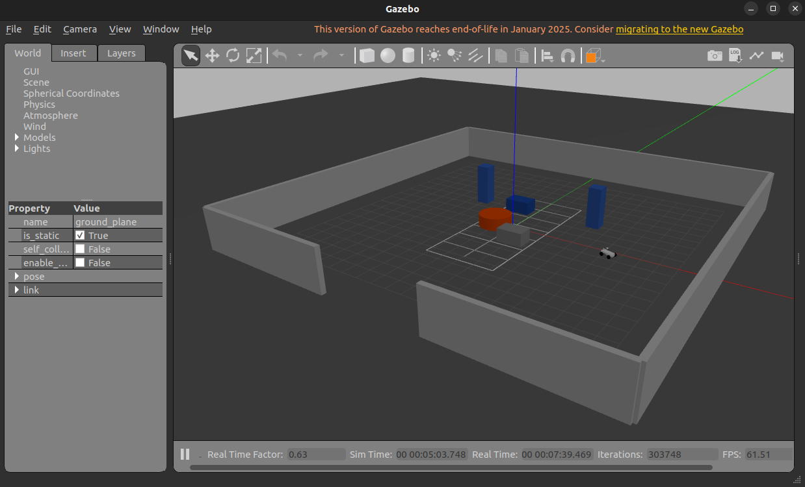
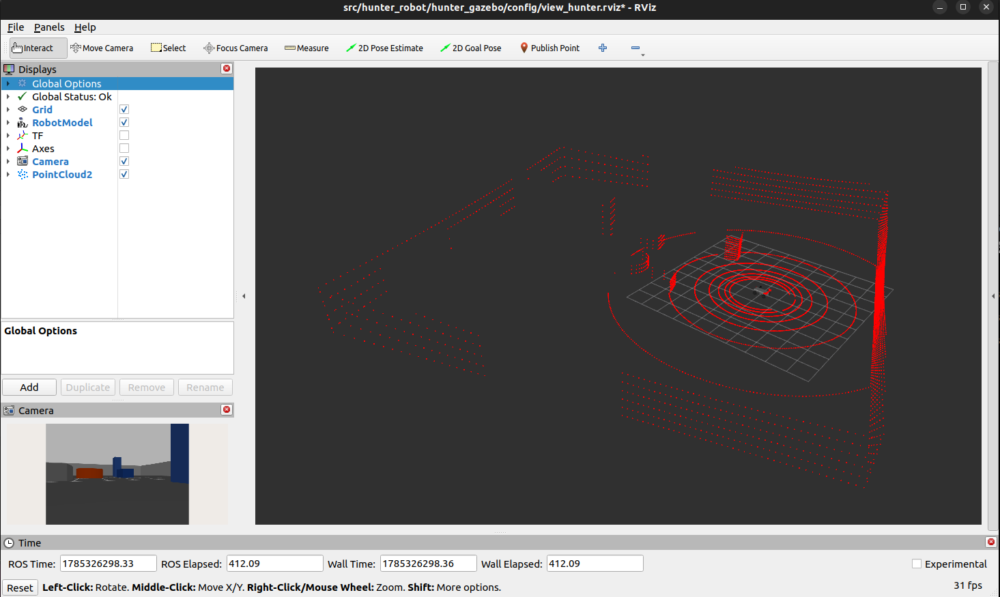
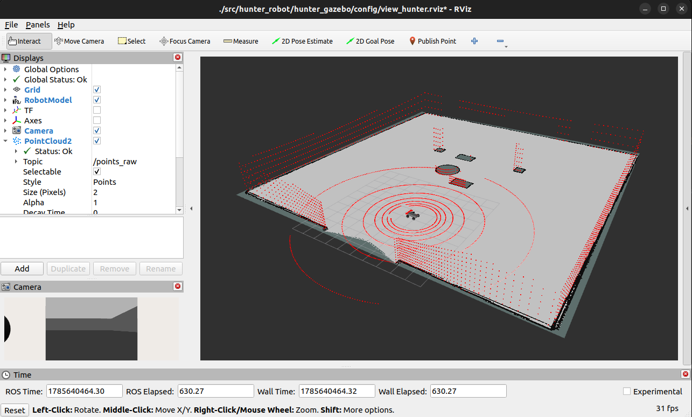
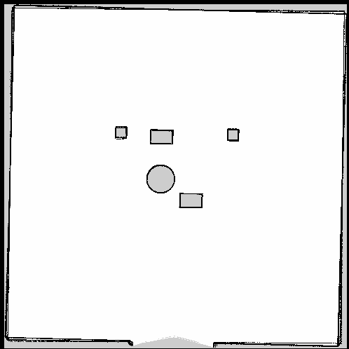

# Proj_Calling_the_vehicle_remotely_in_a_simulation_env

* Update: 2026.08.03.(프로젝트 5/10 단계 진행 중)
* Project duration: 2026.07.15 ~
## 1. Description
* 시뮬레이션 환경에서 리모컨(Qt Dashborad)으로 차량을 호출하면, 차량은 리모컨의 위치로 자율 주행 이동.(프로젝트 과정은 '/documents/RM_Step01-10_*.md'에 정리하며 진행)
* **Github Repository:** https://github.com/Centaucyan/Proj_Calling_the_vehicle_remotely_in_a_virtual_environment.git
* **Vehicle model:** AgileX Hunter
* **Tool:**
  * 지도 작성
    * slam-toolbox
    * nav2-map-server
  * Navigation
    * navigation2
    * nav2-bringup
    





---

## 2. Environment
* **OS:** Ubuntu 22.04 LTS(Jammy Jellyfish)
* **Language:** C++, Python(Ver: 3.10)
* **Middle ware:** ROS 2 Humble Hawksbill
* **Simulator:** Gazebo
* **Visualization Tool:** RViz2
---

## 3. 저장소 클론 및 서브모듈(Submodule) 다운로드 가이드

다른 PC나 새로운 개발 환경에서 이 저장소를 클론할 때 외부 의존성 서브모듈(`ros2_ws/src/hunter_ros2` 등)을 함께 내려받는 2가지 방법.

### 3.1. [방법 1] 저장소 클론 시 서브모듈 한 번에 내려받기 (추천 🌟)
`--recurse-submodules` 옵션을 사용하면 메인 저장소와 연결된 모든 서브모듈을 한 번에 자동으로 클론함.

```bash
git clone --recurse-submodules https://github.com/Centaucyan/Proj_Calling_the_vehicle_remotely_in_a_virtual_environment.git
cd Proj_Calling_the_vehicle_remotely_in_a_virtual_environment
```

### 3.2. [방법 2] 일반 `git clone` 후 서브모듈 별도 동기화하기
이미 `git clone`을 실행했거나 서브모듈이 다운로드되지 않아 폴더가 비어있는 경우 서브모듈을 초기화하고 수동으로 내려받음.

```bash
# 1. 메인 저장소 클론 및 이동
git clone https://github.com/Centaucyan/Proj_Calling_the_vehicle_remotely_in_a_virtual_environment.git
cd Proj_Calling_the_vehicle_remotely_in_a_virtual_environment

# 2. 서브모듈 초기화 및 동기화 다운로드
git submodule update --init --recursive
```
---

## 4. Pre-installation

본 프로젝트 실행에 필요한 ROS 2 Humble 및 시뮬레이션 의존성 패키지 일괄 설치 명령과 주요 패키지별 상세 역할 구분입니다.

```bash
sudo apt update && sudo apt upgrade -y
sudo apt install -y \
  ros-humble-gazebo-ros-pkgs \
  ros-humble-ros2-control \
  ros-humble-ros2-controllers \
  ros-humble-gazebo-ros2-control \
  ros-humble-teleop-twist-keyboard \
  ros-humble-joint-state-publisher \
  ros-humble-joint-state-publisher-gui \
  ros-humble-xacro \
  ros-humble-gazebo-plugins \
  ros-humble-velodyne-description \
  ros-humble-image-transport-plugins \
  ros-humble-rviz2 \
  ros-humble-ackermann-steering-controller \
  ros-humble-ackermann-msgs \
  ros-humble-steering-controllers-library \
  ros-humble-slam-toolbox \
  ros-humble-nav2-map-server \
  ros-humble-pointcloud-to-laserscan \
  ros-humble-navigation2 \
  ros-humble-nav2-bringup
```

### 📦 사전 설치 의존성 패키지 상세 개별 목록

| 분류 | 패키지명 | 역할 및 상세 설명 |
| :--- | :--- | :--- |
| **시뮬레이션 & 기본 제어** | `ros-humble-gazebo-ros-pkgs` | Gazebo 물리 시뮬레이터와 ROS 2 간의 클록, 모델 스폰, 관절 상태 통신 전용 인터페이스 패키지 모음 |
| | `ros-humble-ros2-control` | 로봇 하드웨어와 제어 알고리즘(Controller) 간의 입출력을 총괄 관리하는 ROS 2 표준 제어 프레임워크 |
| | `ros-humble-ros2-controllers` | 관절 상태 브로드캐스터, 위치/속도 제어기 등 표준 로봇 제어기 구현체 라이브러리 모음 |
| | `ros-humble-gazebo-ros2-control` | Gazebo 가상 로봇에 `ros2_control` 제어기를 결합하여 시뮬레이션 모터를 구동하는 전용 플러그인 |
| | `ros-humble-teleop-twist-keyboard` | 키보드 입력을 기반으로 로봇의 이동 속도 명령(`/cmd_vel`)을 퍼블리시하는 수동 조작 노드 |
| | `ros-humble-joint-state-publisher` | 로봇 URDF 각 관절 상태를 수집하고 `/joint_states` 토픽으로 트래킹하는 노드 |
| | `ros-humble-joint-state-publisher-gui` | GUI 인터페이스의 슬라이더를 통해 관절 각도를 수동으로 조작해 볼 수 있는 도구 |
| | `ros-humble-xacro` | 복잡한 로봇 3D/URDF 구조를 매크로, 변수, 파일 분할을 통해 효율적으로 해석하는 XML 파서 툴 |
| **센서 & 차량 조향** | `ros-humble-gazebo-plugins` | Gazebo 가상 환경 내 센서(카메라, LiDAR, IMU 등) 렌더링 및 ROS 2 토픽 수송 공식 플러그인 모음 |
| | `ros-humble-velodyne-description` | Velodyne 3D-LiDAR 센서(VLP-16 등)의 3D 메쉬 파일 및 URDF 링크 정의 패키지 |
| | `ros-humble-image-transport-plugins` | 카메라 영상 데이터(Raw Image)를 압축 전송하여 네트워크 대역폭을 절약하는 플러그인 모음 |
| | `ros-humble-rviz2` | 3D 센서 포인트클라우드, 로봇 3D 모델, TF 좌표계 및 2D/3D 지도를 실시간 관찰하는 시각화 도구 |
| | `ros-humble-ackermann-steering-controller` | 아커만 조향 구조(전륜 조향-후륜 구동) 차량용 ROS 2 범용 **아커만 조향 제어기 플러그인** |
| | `ros-humble-ackermann-msgs` | 아커만 조향 제어 데이터 규격(`ackermann_msgs/msg/AckermannDrive`)을 정의하는 전용 메시지 패키지 |
| | `ros-humble-steering-controllers-library` | 조향 기반 차량 제어기의 공통 역동학 계산 및 궤적 수송을 다루는 하위 C++ 라이브러리 |
| **2D SLAM 매핑** | `ros-humble-slam-toolbox` | 2D 점유 격자 지도 구축, 그래프 최적화(Ceres Solver) 및 루프 클로저를 수행하는 SLAM 패키지 |
| | `ros-humble-nav2-map-server` | 완성된 지도를 정적 파일(`map.yaml`, `.pgm`)로 저장하는 CLI 도구(`map_saver_cli`) 및 맵 서버 패키지 |
| | `ros-humble-pointcloud-to-laserscan` | 3D LiDAR 포인트클라우드(`/points_raw`)를 2D SLAM용 레이저스캔(`/scan`) 토픽으로 실시간 가공/변환 |
| **Nav2 자율주행** | `ros-humble-navigation2` | 전역/지역 경로 계획(Planner/Controller), 비용 지도(Costmap), AMCL 위치추정 및 BT Navigator 핵심 스택 |
| | `ros-humble-nav2-bringup` | Nav2 프레임워크의 여러 노드를 한 번에 구동하고 관리하는 공식 Bringup 런치 스크립트 및 템플릿 |
---

## 5. Execute Commands
```bash
# 1. ros2_ws 이동
cd Proj_Calling_the_vehicle_remotely_in_a_virtual_environment/ros2_ws

# 2. 의존성 패키지 설치(git clone 후 처음에만 실행)
sudo rosdep init
rosdep update
rosdep install --from-paths src --ignore-src -r -y

# 3. ros packages build
colcon build

# 4. Gazebo 시뮬레이션 스폰 (3D-LiDAR & 카메라 통합 로봇)
source install/setup.bash
ros2 launch hunter_gazebo launch_sim.launch.py

# 5. 새 터미널에서 RViz2 구동 및 센서 시각화 확인
source install/setup.bash
rviz2 -d src/hunter_robot/hunter_gazebo/config/view_hunter.rviz

# 6. 새 터미널에서 키보드 노드 실행 및 차량 조작
source install/setup.bash
ros2 run teleop_twist_keyboard teleop_twist_keyboard
```

## 6. Reference
* **Github Repository:** 
  * https://github.com/LCAS/hunter_robot.git
  * https://github.com/agilexrobotics/ugv_sdk.git
---

## 7. ROS2 노드 구성도 (아키텍처)

---