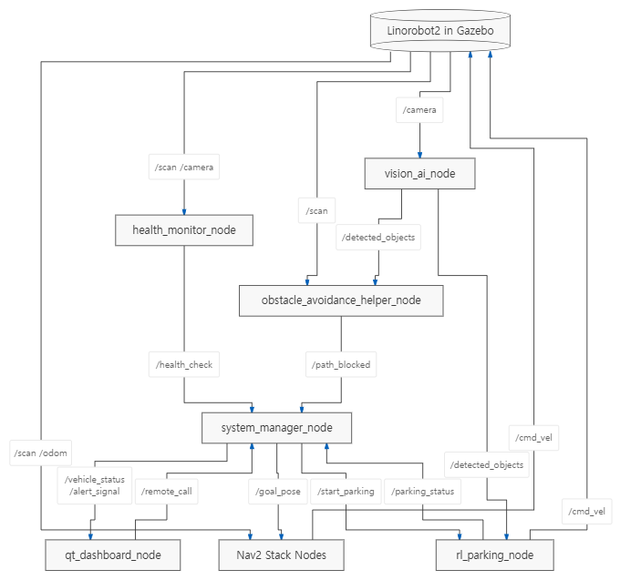

# Proj_Calling_the_vehicle_remotely_in_a_simulation_env

## 1. Description
* When a vehicle is summoned via remote control in a simulation environment, it will drive autonomously to the location of the remote control.
---

## 2. Environment
* **OS:** Ubuntu 22.04 LTS(Jammy Jellyfish)
* **Language:** C++, Python(ver: 3.12.13)
* **Middle ware:** ROS2 Humble
* **Visualization Tool:** RViz2
---

## 3. 저장소 클론 및 서브모듈(Submodule) 다운로드 가이드

다른 PC나 새로운 개발 환경에서 이 저장소를 클론할 때 외부 의존성 서브모듈(`ros2_ws/src/hunter_ros2` 등)을 함께 내려받는 2가지 방법입니다.

### 3.1. [방법 1] 저장소 클론 시 서브모듈 한 번에 내려받기 (추천 🌟)
`--recurse-submodules` 옵션을 사용하면 메인 저장소와 연결된 모든 서브모듈을 한 번에 자동으로 클론합니다.

```bash
git clone --recurse-submodules https://github.com/Centaucyan/Proj_Calling_the_vehicle_remotely_in_a_virtual_environment.git
cd Proj_Calling_the_vehicle_remotely_in_a_virtual_environment
```

### 3.2. [방법 2] 일반 `git clone` 후 서브모듈 별도 동기화하기
이미 `git clone`을 실행했거나 서브모듈이 다운로드되지 않아 폴더가 비어있는 경우 서브모듈을 초기화하고 수동으로 내려받습니다.

```bash
# 1. 메인 저장소 클론 및 이동
git clone https://github.com/Centaucyan/Proj_Calling_the_vehicle_remotely_in_a_virtual_environment.git
cd Proj_Calling_the_vehicle_remotely_in_a_virtual_environment

# 2. 서브모듈 초기화 및 동기화 다운로드
git submodule update --init --recursive
```
---

## 4. Reference
* **git repository:** https://github.com/agilexrobotics/hunter_ros2.git
---

## 5. Pre-installation
* $ sudo apt update && sudo apt upgrade
* $ sudo apt install -y \
  ros-humble-gazebo-ros-pkgs \
  ros-humble-ros2-control \
  ros-humble-ros2-controllers \
  ros-humble-gazebo-ros2-control \
  ros-humble-teleop-twist-keyboard \
  ros-humble-joint-state-publisher \
  ros-humble-joint-state-publisher-gui \
  ros-humble-xacro
---

## 6. ROS2 노드 구성도 (아키텍처)

---