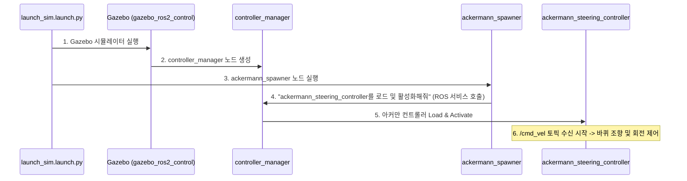
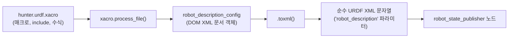
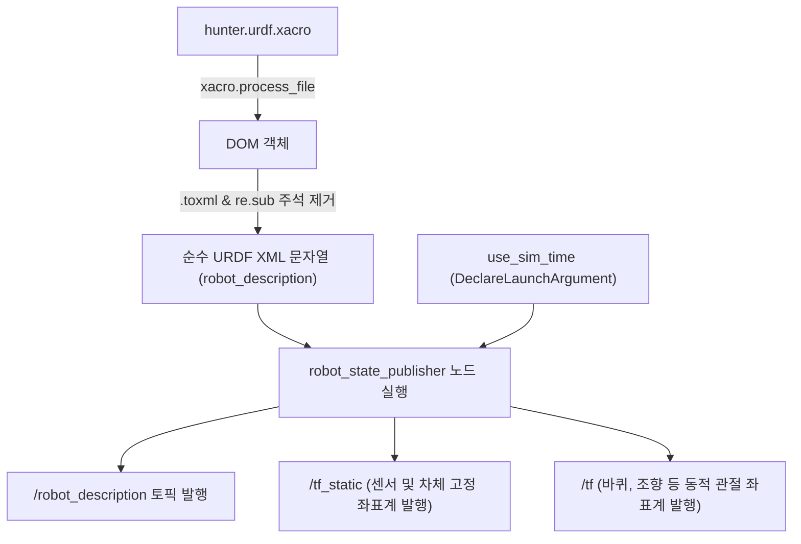
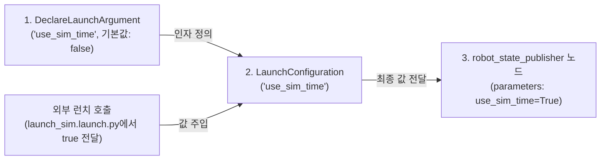
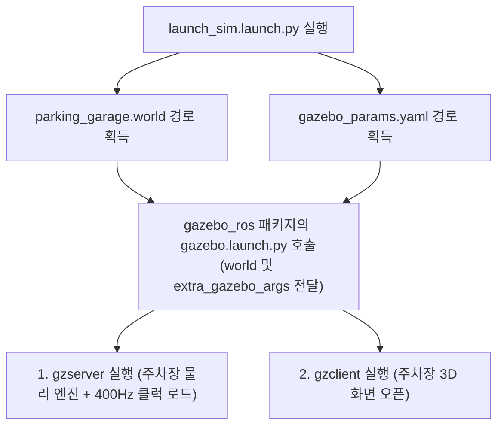
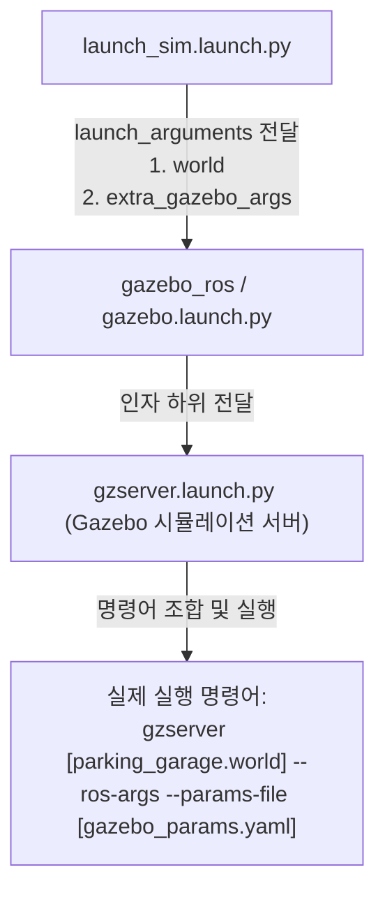
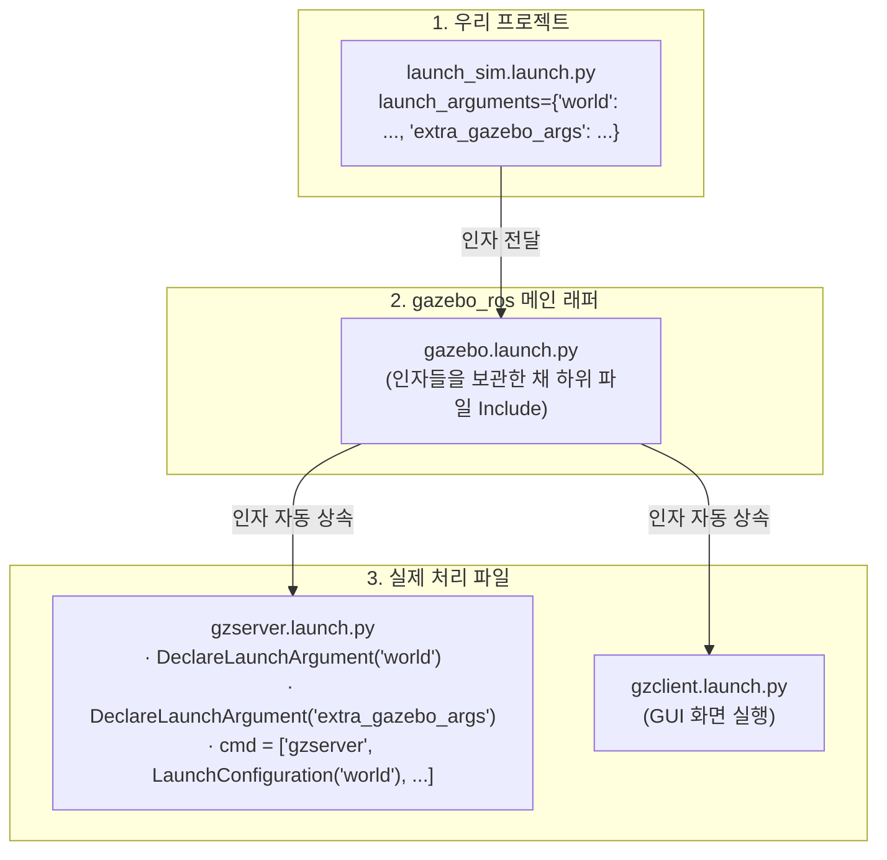
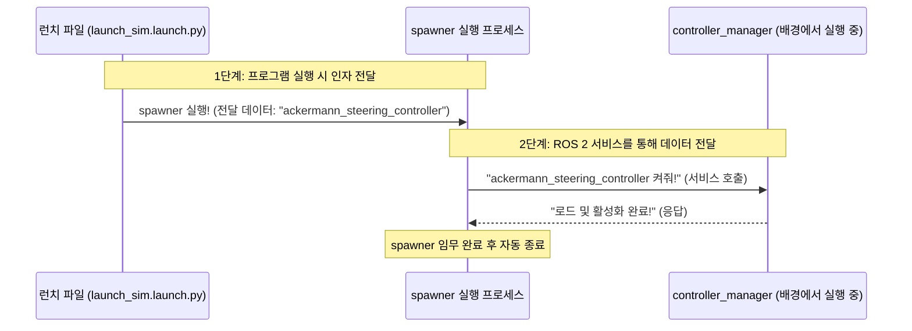
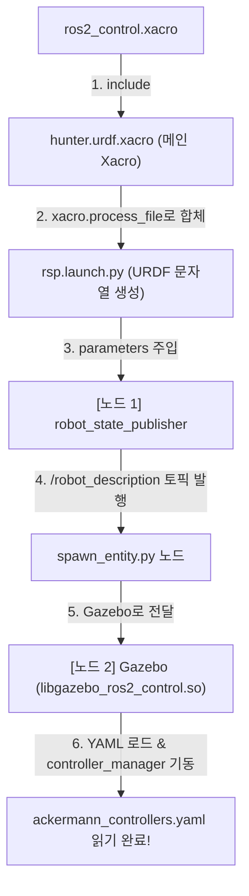
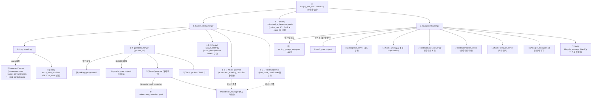

# 2026년 08월 15일 대화 기록 (Conversation History)

**작성일시:** 2026-08-15
**대화 주제:** ROS 2 Launch 파일 구조 분석 (`launch_sim.launch.py`, `rsp.launch.py`, `bringup_sim_nav2.launch.py`) 및 전체 계층 아키텍처 다이어그램 생성

---

## 🧑 사용자 (User) - Q1

launch_sim.launch.py 파일 내용을 보면 ackermann_spawner 변수에 controller_manager 패키지의 실행파일은 spawner로 실행시키는 내용이 있다. 이에 대해 상세히 설명해줘.

---

## 🤖 어시스턴트 (Antigravity)

[`launch_sim.launch.py`](file:///Proj_Calling_the_vehicle_remotely_in_a_virtual_environment/ros2_ws/src/hunter_robot/hunter_gazebo/launch/launch_sim.launch.py#L63-L70) 파일의 `ackermann_spawner` 코드 및 `controller_manager` 패키지의 `spawner` 실행파일에 대한 상세 설명입니다.

---

### 1. 코드 위치 및 구문
```python
# [launch_sim.launch.py] (Line 63~70)
ackermann_spawner = Node(
    package="controller_manager",
    executable="spawner",
    arguments=["ackermann_steering_controller"],
    remappings=[
        ("/ackermann_steering_controller/reference_unstamped", "/cmd_vel"),
    ]
)
```

---

### 2. `controller_manager`와 `spawner`의 역할

#### ① `controller_manager` (컨트롤러 매니저)란?
`ros2_control` 프레임워크의 핵심 중앙 관리 노드로, 로봇의 하드웨어 인터페이스(또는 Gazebo 시뮬레이터)와 조향/구동 제어 알고리즘(컨트롤러) 사이를 연결해 줍니다.
* 컨트롤러의 전체 **생명주기(Load → Configure → Activate/Start → Deactivate/Stop → Unload)**를 제어하는 역할을 담당합니다.
* Gazebo 시뮬레이션 환경에서는 URDF에 포함된 `gazebo_ros2_control` 플러그인이 Gazebo 실행 시 내부적으로 `controller_manager`를 백그라운드에 구동합니다.

#### ② `spawner` 실행파일(Executable)이란?
`spawner`는 `controller_manager`에게 특정 컨트롤러를 로드(Load)하고 바로 활성화(Activate)시키도록 명령을 전달하는 **자동화 헬퍼 스크립트/노드**입니다.
* Gazebo와 `controller_manager`가 먼저 구동된 후, `spawner` 노드가 독립 실행되어 `controller_manager`가 제공하는 ROS 2 서비스(`load_controller`, `configure_controller`, `switch_controller` 등)를 호출합니다.
* 이를 통해 사용자가 일일이 CLI 명령어로 컨트롤러를 로드하지 않아도 런치 파일 실행 한 번으로 해당 컨트롤러가 자동 활성화됩니다.

---

### 3. `ackermann_spawner` 주요 매개변수 상세 분석

| 항목 | 설정값 | 상세 설명 |
| :--- | :--- | :--- |
| **`package`** | `"controller_manager"` | ROS 2 Control 제어 매니저 관련 패키지 지정 |
| **`executable`** | `"spawner"` | 컨트롤러 로드 및 활성화를 수행하는 CLI utility 노드 실행파일 |
| **`arguments`** | `["ackermann_steering_controller"]` | `controller_manager`에 등록 및 활성화할 **컨트롤러 이름**입니다. YAML 설정 파일에 선언된 아커만 조향 전용 컨트롤러를 지정합니다. |
| **`remappings`** | `[("/ackermann_steering_controller/reference_unstamped", "/cmd_vel")]` | 토픽 이름 리매핑 설정입니다. |

#### 💡 `remappings` 설정이 필수적인 이유
* **기본 요구 토픽**: ROS 2의 `ackermann_steering_controller` 패키지는 제어 명령어(Twist)를 수신할 때 기본적으로 `/ackermann_steering_controller/reference_unstamped` (또는 `reference`)라는 길고 특화된 토픽 이름을 사용합니다.
* **표준 토픽과의 불일치**: 일반적인 ROS 2 원격 조종 패키지(`teleop_twist_keyboard`), 주행 알고리즘 패키지, 또는 Nav2 내비게이션 스택은 조향 및 속도 명령을 표준 이동 토픽인 **`/cmd_vel`**로 발행합니다.
* **해결책**: `remappings` 구문을 통해 컨트롤러가 구독하는 입력 토픽을 `/cmd_vel`로 연결해주어, 키보드 조종기나 라즈베리파이/원격 서버에서 `/cmd_vel`로 메시지를 발행할 때 차량이 바로 아커만 조향 방식으로 구동될 수 있도록 만든 것입니다.

---

### 4. 전체 시뮬레이션 실행 시 동작 흐름



1. [`launch_sim.launch.py`](file:///Proj_Calling_the_vehicle_remotely_in_a_virtual_environment/ros2_ws/src/hunter_robot/hunter_gazebo/launch/launch_sim.launch.py#L63-L70)가 실행되며 Gazebo 시뮬레이터가 열립니다.
2. Gazebo 내 `gazebo_ros2_control` 플러그인이 `controller_manager`를 백그라운드에 구동합니다.
3. `ackermann_spawner` 노드가 구동되어 `controller_manager`에게 `ackermann_steering_controller`를 활성화하라고 지시합니다.
4. 아커만 컨트롤러가 구동되면서 `/cmd_vel` 토픽으로 들어오는 속도(`linear.x`)와 조향 각속도(`angular.z`)를 계산하여, Hunter 로봇의 조향 휠(Steering wheel joint) 및 구동 바퀴(Wheel joint) 관절을 실제 조향 기하학 모델에 맞게 직접 제어하기 시작합니다.

---

## 🧑 사용자 (User) - Q2

get_package_share_directory()에 대해 알려줘~

---

## 🤖 어시스턴트 (Antigravity)

`get_package_share_directory()`는 **ROS 2 Python 런치 파일이나 노드 작성 시 특정 ROS 2 패키지의 설치 경로(`share` 디렉토리)를 자동으로 찾아 반환해 주는 핵심 유틸리티 함수**입니다.

---

### 1. 기본 개념 및 모듈 위치

* **모듈 위치**: `ament_index_python.packages`
* **사용법**:
  ```python
  from ament_index_python.packages import get_package_share_directory

  pkg_path = get_package_share_directory('패키지_이름')
  ```
* **반환값**: 지정한 ROS 2 패키지가 빌드 및 설치된 `share` 디렉토리의 **절대 경로(String)**

---

### 2. 왜 사용할까요? (핵심 장점)

#### ① 환경/사용자 이식성 (Portability) 보장
만약 런치 파일에서 파일 경로를 아래와 같이 **하드코딩(Hardcoding)**하면:
```python
# ❌ 잘못된 예: 다른 PC나 다른 사용자 폴더에서는 에러 발생
world_path = "/home/tae/Tae_ws/ros2_ws/src/hunter_gazebo/worlds/parking_garage.world"
```
다른 컴퓨터에서 실행하거나 폴더 위치를 옮겼을 때 파일을 찾을 수 없어 에러가 발생합니다.

반면 `get_package_share_directory()`를 사용하면:
```python
# 점 좋은 예: 어디서든 자동으로 현재 ROS 2 환경에 설치된 경로를 탐색
world_path = os.path.join(
    get_package_share_directory('hunter_gazebo'), 'worlds', 'parking_garage.world'
)
```
어떤 사용자 컴퓨터나 경로 환경이든 자동으로 현재 ROS 2 워크스페이스의 설치 경로를 탐색해 줍니다.

#### ② 외부/공식 ROS 2 패키지 리소스 쉽게 가져오기
내가 만든 패키지 외에도 ROS 2 시스템에 기본 설치된 다른 패키지(예: `gazebo_ros`, `nav2_bringup`, `robot_state_publisher` 등)의 런치 파일이나 설정 파일 경로를 간편하게 가져올 수 있습니다.

---

### 3. 실제 작동 방식 (`install` 폴더와의 관계)

ROS 2에서 `colcon build`를 실행하면, 각 패키지의 `setup.py` 또는 `CMakeLists.txt`에 정의된 규칙에 따라 런치 파일, 월드 파일, RViz 설정 파일, URDF 모델 등이 워크스페이스의 **`install/<패키지명>/share/<패키지명>/`** 경로로 복사(설치)됩니다.

`get_package_share_directory('hunter_gazebo')`를 호출하면 ROS 2 환경 변수(`AMENT_PREFIX_PATH`)를 탐색하여 아래와 같은 실제 절대 경로를 반환합니다.

> `.../ros2_ws/install/hunter_gazebo/share/hunter_gazebo`

---

### 4. 사용자 프로젝트에서의 실제 사용 예시

현재 프로젝트의 [`launch_sim.launch.py`](file:///Proj_Calling_the_vehicle_remotely_in_a_virtual_environment/ros2_ws/src/hunter_robot/hunter_gazebo/launch/launch_sim.launch.py#L20-L43) 파일에서 다음과 같이 다양하게 활용되고 있습니다.

```python
# 1. 다른 패키지(hunter_description)의 런치 파일(rsp.launch.py) 경로 가져오기
rsp_launch_path = os.path.join(
    get_package_share_directory('hunter_description'), 'launch', 'rsp.launch.py'
)

# 2. 내 패키지(hunter_gazebo)의 월드(world) 파일 경로 가져오기
world_file_path = os.path.join(
    get_package_share_directory('hunter_gazebo'), 'worlds', 'parking_garage.world'
)

# 3. ROS 2 공식 패키지(gazebo_ros)의 메인 실행 런치 파일 경로 가져오기
gazebo_launch_path = os.path.join(
    get_package_share_directory('gazebo_ros'), 'launch', 'gazebo.launch.py'
)
```

---

### ⚠️ 자주 발생하는 주의사항

1. **`PackageNotFoundError` 에러가 발생하는 경우**:
   - 패키지 이름을 철자가 틀리게 입력한 경우
   - `colcon build`를 하지 않아 `install` 디렉토리에 패키지가 설치되지 않은 경우
   - 터미널에서 `source install/setup.bash` (또는 `setup.zsh`)를 실행하지 않아 ROS 2 인덱스에 패키지가 등록되지 않은 경우

2. **파일을 수정했는데 반영되지 않는 경우**:
   - `get_package_share_directory()`는 `src/` 폴더가 아닌 **`install/` 폴더**의 경로를 참조합니다.
   - 따라서 `src/` 폴더 안의 `.yaml`, `.world`, `.launch.py` 파일 등을 수정한 후에는 반드시 `colcon build`를 다시 해주거나 `--symlink-install` 옵션으로 빌드해야 변경 사항이 즉시 적용됩니다.

---

## 🧑 사용자 (User) - Q3

robot_description_config = xacro.process_file(xacro_file)
이것도 설명해줘

---

## 🤖 어시스턴트 (Antigravity)

`robot_description_config = xacro.process_file(xacro_file)`는 **Xacro(`.urdf.xacro`) 매크로 파일을 파싱하고 해석하여, 최종적으로 순수한 URDF(XML 문서 객체)로 변환해 주는 Python xacro 라이브러리 함수**입니다.

---

### 1. 코드 위치 및 전후 문맥
[`rsp.launch.py`](file:///Proj_Calling_the_vehicle_remotely_in_a_virtual_environment/ros2_ws/src/hunter_robot/hunter_description/launch/rsp.launch.py#L20-L28)에서 다음과 같이 사용됩니다.

```python
# 1. xacro 파일 경로 지정
xacro_file = os.path.join(pkg_path, 'description', 'hunter.urdf.xacro')

# 2. xacro 파일을 파싱하여 내부 XML 객체로 변환 🌟
robot_description_config = xacro.process_file(xacro_file)

# 3. XML 문자열로 추출하여 robot_description 파라미터에 전달
doc_xml = robot_description_config.toxml()
params = {'robot_description': doc_xml, 'use_sim_time': use_sim_time}
```

---

### 2. 왜 Xacro를 변환(Process)해야 할까요?

#### ① URDF vs Xacro
* **URDF (Unified Robot Description Format)**: 로봇의 링크(바디, 바퀴), 조인트(관절), 센서, 질량/관성 등을 정의하는 순수 XML 포맷입니다. 변수나 매크로를 쓸 수 없어 중복 코드가 많고 파일 관리가 어렵습니다.
* **Xacro (XML Macros)**: URDF에 **매크로(`xacro:macro`), 변수(`xacro:property`), 수식 계산(`${}`), 파일 분할(`xacro:include`), 조건문(`xacro:if`)** 등의 프로그래밍 기능을 추가한 확장 포맷입니다.

#### ② 변환이 필요한 이유
`robot_state_publisher`, RViz2, Gazebo 같은 ROS 2 노드들은 `.xacro` 문법(변수, 매크로 등)을 직접 해석할 수 없습니다. 오직 **모든 매크로와 수식 계산이 완료된 순수한 XML(URDF)** 문자열만 이해할 수 있습니다.

따라서 런치 시점에 `xacro.process_file()`을 호출하여 `.urdf.xacro`를 순수 URDF로 실시간 컴파일/변환하는 것입니다.

---

### 3. `xacro.process_file()`의 동작 과정



1. **파일 읽기 & Include 병합**: `hunter.urdf.xacro` 파일 및 그 안에 `<xacro:include>`로 포함된 서브 xacro 파일들(센서, 바퀴, 관절 정의 등)을 모두 불러옵니다.
2. **매크로 치환 및 수식 계산**: 정의된 프로퍼티 변수와 `${2*pi}`, `${wheel_radius}` 같은 수식을 실제 수치로 계산하여 대체합니다.
3. **XML DOM 객체 생성**: 파싱이 완료된 최종 XML 구조체(`xml.dom.minidom.Document`)를 메모리에 생성하여 `robot_description_config` 변수에 반환합니다.

---

### 4. Python API 방식(`xacro.process_file`)의 장점

ROS 2 런치 파일에서 Xacro를 처리하는 방법은 크게 두 가지가 있습니다:

| 방식 | 작성 예시 | 특징 |
| :--- | :--- | :--- |
| **CLI 명령 호출 방식** | `Command(['xacro ', xacro_file])` | 쉘 프로세스를 외부 실행하여 결과를 문자열로 받아옴 |
| **Python API 방식 (현재 사용)** | `xacro.process_file(xacro_file)` | Python 내부 메모리에서 직접 고속 처리하며, 파싱 에러 발생 시 디버깅이 명확함 |

특히 현재 코드([`rsp.launch.py:L26-L27`](file:///Proj_Calling_the_vehicle_remotely_in_a_virtual_environment/ros2_ws/src/hunter_robot/hunter_description/launch/rsp.launch.py#L26-L27))처럼 XML 문자열을 얻은 뒤 **정규식(`re.sub`)으로 주석을 제거하거나 문자열을 가공해야 하는 경우**, Python API 방식인 `xacro.process_file()`이 훨씬 유연하고 안정적입니다.

---

## 🧑 사용자 (User) - Q4

rsp.launch.py 파일 전체를 부분부분 모두 상세히 설명해줘~

---

## 🤖 어시스턴트 (Antigravity)

[`rsp.launch.py`](file:///Proj_Calling_the_vehicle_remotely_in_a_virtual_environment/ros2_ws/src/hunter_robot/hunter_description/launch/rsp.launch.py) 파일은 로봇 모델의 3D 형상 및 관절 구조(URDF/Xacro)를 읽어와 **`robot_state_publisher` 노드를 실행하는 ROS 2 런치 파일**입니다.

이 파일은 로봇의 3D 좌표 변환 트리(TF: `/tf`, `/tf_static`)를 생성하여 RViz2, Gazebo, Nav2 등이 로봇의 링크와 센서 위치를 올바르게 인식하도록 해주는 필수 파일입니다.

전체 코드를 기능 단위별로 나누어 상세히 설명해 드리겠습니다.

---

### 1. 모듈 임포트 (Lines 1 ~ 10)

```python
import os

from ament_index_python.packages import get_package_share_directory

from launch import LaunchDescription
from launch.substitutions import LaunchConfiguration
from launch.actions import DeclareLaunchArgument
from launch_ros.actions import Node

import xacro
```

* **`os`**: 파일 및 디렉토리 경로 조합(`os.path.join`)을 위한 Python 표준 라이브러리입니다.
* **`get_package_share_directory`**: 워크스페이스에 설치된 ROS 2 패키지(`hunter_description`)의 `share` 디렉토리 절대 경로를 자동으로 찾아옵니다.
* **`LaunchDescription`**: ROS 2 런치 파일에서 실행할 모든 액션(노드, 인자 선언 등)을 담아 반환하는 메인 컨테이너 클래스입니다.
* **`LaunchConfiguration`**: 런치 실행 시 외부에서 전달받는 파라미터 값(예: `use_sim_time`)을 런타임에 동적으로 참조하기 위한 치환(Substitution) 객체입니다.
* **`DeclareLaunchArgument`**: 런치 파일 실행 시 외부 CLI나 다른 런치 파일로부터 넘겨받을 수 있는 인자(Argument)를 정의합니다.
* **`Node`**: ROS 2 노드를 실행하기 위한 액션 객체입니다.
* **`xacro`**: XML 매크로 포맷(`.urdf.xacro`) 파일을 파싱하여 표준 URDF(XML)로 변환해 주는 라이브러리입니다.

---

### 2. 런치 진입 함수 및 런치 설정 (Lines 13 ~ 16)

```python
def generate_launch_description():

    # Check if we're told to use sim time
    use_sim_time = LaunchConfiguration('use_sim_time')
```

* **`generate_launch_description()`**: ROS 2 런치 시스템(`ros2 launch`)이 실행될 때 가장 먼저 탐색하여 호출하는 표준 진입점(Entry Point) 함수입니다.
* **`use_sim_time = LaunchConfiguration('use_sim_time')`**: 시뮬레이터(Gazebo)에서 생성하는 시뮬레이션 시간 클럭(`/clock`)을 사용할지 여부를 담고 있는 변수입니다.

---

### 3. Xacro 파일 경로 탐색 및 파싱 (Lines 18 ~ 21)

```python
    # Process the URDF file
    pkg_path = os.path.join(get_package_share_directory('hunter_description'))
    xacro_file = os.path.join(pkg_path, 'description', 'hunter.urdf.xacro')
    robot_description_config = xacro.process_file(xacro_file)
```

* **`pkg_path`**: `hunter_description` 패키지가 설치된 경로를 가져옵니다.
* **`xacro_file`**: 패키지 내 `description/hunter.urdf.xacro` 파일의 전체 절대 경로를 조합합니다.
* **`robot_description_config = xacro.process_file(xacro_file)`**: xacro 파일에 정의된 매크로(`xacro:macro`), 프로퍼티 변수, 수식, 서브 include 파일들을 모두 평가 및 해석하여 **XML DOM 문서 객체**로 메모리에 로드합니다.

---

### 4. XML 문자열 추출 및 주석 제거 정규식 처리 (Lines 23 ~ 28)

```python
    # Create a robot_state_publisher node
    # params = {'robot_description': robot_description_config.toxml(), 'use_sim_time': use_sim_time}
    doc_xml = robot_description_config.toxml()
    import re
    doc_xml = re.sub(r'<!--.*?-->', '', doc_xml, flags=re.DOTALL)  # XML 주석 제거로 Gazebo 파싱 버그 방지
    params = {'robot_description': doc_xml, 'use_sim_time': use_sim_time}
```

* **`doc_xml = robot_description_config.toxml()`**: DOM XML 객체를 순수한 XML 문자열로 변환합니다.
* **`doc_xml = re.sub(r'<!--.*?-->', '', doc_xml, flags=re.DOTALL)`**: 
  - URDF/Xacro 파일 내에 포함된 XML 주석(`<!-- ... -->`)을 정규표현식으로 모두 제거합니다.
  - **이유**: Gazebo의 특정 SDF 변환 파서(`sdformat_urdf` 등)에서 주석 내 특수문자나 개행 문자로 인해 파싱 에러/충돌이 발생하는 버그를 미연에 방지하기 위한 안전장치입니다.
* **`params = {'robot_description': doc_xml, 'use_sim_time': use_sim_time}`**: 노드 실행 시 넘겨줄 파라미터 딕셔너리(`robot_description` 문자열과 `use_sim_time`)를 구성합니다.

---

### 5. `robot_state_publisher` 노드 선언 (Lines 29 ~ 34)

```python
    node_robot_state_publisher = Node(
        package='robot_state_publisher',
        executable='robot_state_publisher',
        output='screen',
        parameters=[params]
    )
```

* **`package='robot_state_publisher'` / `executable='robot_state_publisher'`**: 로봇 상태 퍼블리셔 노드를 실행합니다.
* **`output='screen'`**: 노드의 콘솔 출력(로그 및 에러 메시지)을 터미널 화면에 직접 출력합니다.
* **`parameters=[params]`**: 위에서 준비한 URDF 문자열(`robot_description`)과 시뮬레이션 시간 사용 여부(`use_sim_time`) 파라미터를 노드에 주입합니다.
  - 이 노드가 실행되면 로봇의 고정 링크 관계를 나타내는 정적 TF(`tf_static`)를 발행하고, `/joint_states` 토픽을 구독하여 움직이는 관절의 동적 TF(`/tf`)를 계산해 발행합니다.

---

### 6. 런치 인자 선언 및 반환 (Lines 37 ~ 46)

```python
    # Launch!
    return LaunchDescription([
        DeclareLaunchArgument(
            'use_sim_time',
            default_value='false',
            description='Use sim time if true'),

        node_robot_state_publisher
    ])
```

* **`DeclareLaunchArgument(...)`**:
  - `use_sim_time`이라는 런치 옵션을 선언합니다.
  - 기본값(`default_value`)은 `'false'`(실제 하드웨어 기준)이며, Gazebo 시뮬레이션(`launch_sim.launch.py`)에서 이 파일을 호출할 때는 `launch_arguments={'use_sim_time': 'true'}`로 재정의하여 넘겨주게 됩니다.
* **`return LaunchDescription([...])`**: 선언한 인자(`DeclareLaunchArgument`)와 실행할 노드(`node_robot_state_publisher`)를 리스트 형태로 담아 반환함으로써 런치 실행을 완료합니다.

---

### 📊 전체 동작 요약 흐름도



---

## 🧑 사용자 (User) - Q5

2. 런치 진입 함수 및 런치 설정 (Lines 13 ~ 16)
이것부터 다시 상세히 알려줘. 'use_sim_time'은 그냥 텍스트 글자 아니야?

---

## 🤖 어시스턴트 (Antigravity)

아주 좋은 질문입니다! 

질문하신 대로 코드 상의 `'use_sim_time'` 자체는 따옴표로 감싸진 **문자열(String 텍스트)**이 맞습니다. 하지만 이것은 단순한 글자가 아니라 **ROS 2 전체에서 표준으로 약속된 '특별한 설정 키(Key) 이름'**입니다.

이 부분(Lines 13 ~ 16)과 관련된 핵심 개념을 하나씩 알기 쉽게 풀어 설명해 드리겠습니다.

---

### 1. `def generate_launch_description():` (런치 진입 함수)

```python
def generate_launch_description():
```

* **역할**: ROS 2 런치 시스템(`ros2 launch`)이 실행될 때 **가장 먼저 찾아서 호출하는 표준 진입 함수(Entry Point)**입니다.
* **동작 원리**: 
  - ROS 2는 런치 파일을 일반 파이썬 스크립트처럼 위에서 아래로 즉시 실행하지 않습니다.
  - 먼저 이 함수를 실행하여 **"어떤 노드를 띄우고, 어떤 인자를 받을지 적혀 있는 실행 설계도(`LaunchDescription`)"**를 반환받은 뒤, ROS 2 런치 엔진이 그 설계도대로 노드들을 순차적으로 실행합니다.

---

### 2. `'use_sim_time'`은 왜 단순한 글자가 아닐까요?

```python
use_sim_time = LaunchConfiguration('use_sim_time')
```

#### ① ROS 2에서의 표준 약속 (`use_sim_time`)
ROS 2의 모든 표준 노드(`robot_state_publisher`, `nav2`, `rviz2` 등)에는 내장된 공통 규칙이 있습니다:
* **`use_sim_time: false` (실제 로봇 환경)**
  - 컴퓨터 본체의 실제 시계(System Clock / Real Time)를 기준으로 센서 데이터와 TF 시간을 계산합니다.
* **`use_sim_time: true` (가상 시뮬레이션 환경)**
  - 컴퓨터의 실제 시계를 무시하고, **Gazebo 시뮬레이터가 발행하는 가상 시간 토픽(`/clock`)**에 모든 노드의 시계를 동기화합니다.
  - **이유**: 컴퓨터 사양이나 물리 연산 부하로 인해 Gazebo가 실제 시간보다 느리게 돌아갈 때, 노드들이 실제 시계를 쓰면 **"TF 시간 불일치 에러(Extrapolation Error / Timestamp too old)"**가 발생하기 때문입니다.

---

#### ② `LaunchConfiguration('use_sim_time')`의 진짜 역할: "지연 평가(Placeholder)"

파이썬 변수에 단순히 문자열이나 불리언을 넣는 것과 `LaunchConfiguration`을 사용하는 것에는 큰 차이가 있습니다.

* 만약 `use_sim_time = True` 처럼 하드코딩하면:
  - 이 런치 파일은 무조건 시뮬레이션에서만 쓸 수 있고, 실제 로봇에서는 재사용할 수 없게 됩니다.
* `use_sim_time = LaunchConfiguration('use_sim_time')`을 사용하면:
  - **"지금 당장 값을 확정하지 말고, 나중에 사용자가 런치를 실행할 때 넘겨주는 `'use_sim_time'` 인자 값을 가져와서 채워 넣어라"**라는 **자리표시자(플레이스홀더)** 역할을 합니다.

---

### 3. 세 코드가 하나로 이어지는 동작 흐름

이 코드가 실제로 어떻게 값을 받아 동작하는지 3단계로 보면 매우 직관적입니다.



#### 1단계: 런치 인자 선언 ([`rsp.launch.py:L39-L42`](file:///Proj_Calling_the_vehicle_remotely_in_a_virtual_environment/ros2_ws/src/hunter_robot/hunter_description/launch/rsp.launch.py#L39-L42))
```python
DeclareLaunchArgument(
    'use_sim_time',
    default_value='false',
    description='Use sim time if true'
)
```
> 📢 *"이 런치 파일은 외부에서 `use_sim_time`이라는 옵션을 받을 수 있습니다. 안 주면 기본값은 `'false'`입니다."*

#### 2단계: 플레이스홀더 바인딩 ([`rsp.launch.py:L16`](file:///Proj_Calling_the_vehicle_remotely_in_a_virtual_environment/ros2_ws/src/hunter_robot/hunter_description/launch/rsp.launch.py#L16))
```python
use_sim_time = LaunchConfiguration('use_sim_time')
params = {'robot_description': doc_xml, 'use_sim_time': use_sim_time}
```
> 📦 *"노드 파라미터의 `use_sim_time` 항목에 외부에서 들어올 값을 연결해 둡니다."*

#### 3단계: 외부에서 실제 값 전달 ([`launch_sim.launch.py:L18-L21`](file:///Proj_Calling_the_vehicle_remotely_in_a_virtual_environment/ros2_ws/src/hunter_robot/hunter_gazebo/launch/launch_sim.launch.py#L18-L21))
Gazebo 시뮬레이션을 실행하는 `launch_sim.launch.py`에서는 이 파일을 부를 때 다음과 같이 `'true'`를 전달합니다:
```python
rsp = IncludeLaunchDescription(
    PythonLaunchDescriptionSource([...]),
    launch_arguments={'use_sim_time': 'true'}.items()  # 👈 여기서 'true'를 주입!
)
```

---

### 💡 한 줄 요약
`'use_sim_time'`은 단순한 글자 모양의 텍스트이지만, **"ROS 2 시스템 시간 동기화 모드를 결정하는 표준 파라미터 이름"**이며, `LaunchConfiguration('use_sim_time')`은 **외부(시뮬레이터 런치 파일이나 터미널 CLI)에서 넘겨주는 `true`/`false` 값을 런타임에 동적으로 받아오기 위한 통로**입니다.

---

## 🧑 사용자 (User) - Q6

5. robot_state_publisher 노드 선언 (Lines 29 ~ 34) 여기에서 
robot_state_publisher는 어느 패키지를 설치하면 실행할 수 있니?
spawner는 sms ros2-controller를 설치해야 한다고 알고 있는데...

---

## 🤖 어시스턴트 (Antigravity)

`robot_state_publisher`와 `spawner` 실행을 위해 필요한 패키지 정보와 설치 명령어입니다.

현재 사용 중이신 **ROS 2 Humble** 기준입니다.

---

### 1. `robot_state_publisher` 패키지

`robot_state_publisher`는 ROS 2의 핵심 표준 패키지 중 하나로, 다음 명령어로 설치할 수 있습니다.

```bash
sudo apt install ros-humble-robot-state-publisher
```

> **💡 참고**: 
> ROS 2를 처음 설치할 때 `ros-humble-desktop` 또는 `ros-humble-desktop-full` 메타 패키지로 설치하셨다면 기본적으로 이미 함께 설치되어 있습니다.

---

### 2. `spawner` 및 `controller_manager` 패키지

말씀하신 내용이 정확히 맞습니다! `spawner`는 **`ros2_control`** 프레임워크에 속해 있으며, 구체적인 패키지 구성은 다음과 같습니다.

1. **`spawner` 실행파일이 들어있는 패키지**: `controller_manager`
   ```bash
   sudo apt install ros-humble-controller-manager
   ```
2. **`ackermann_steering_controller` 등 제어 알고리즘 패키지**: `ros2_controllers`
   ```bash
   sudo apt install ros-humble-ros2-controllers
   ```
3. **Gazebo와 ros2_control을 연결해 주는 플러그인 패키지**: `gazebo_ros2_control`
   ```bash
   sudo apt install ros-humble-gazebo-ros2-control
   ```

---

### 📋 한 번에 전체 설치하는 추천 명령어

프로젝트에서 Gazebo 시뮬레이션 및 아커만 조향 제어기를 원활하게 실행하려면 아래 명령어로 관련 패키지를 모두 설치해 두시면 됩니다:

```bash
sudo apt update
sudo apt install -y \
  ros-humble-robot-state-publisher \
  ros-humble-joint-state-publisher \
  ros-humble-xacro \
  ros-humble-ros2-control \
  ros-humble-ros2-controllers \
  ros-humble-controller-manager \
  ros-humble-gazebo-ros2-control
```

| 실행 파일 / 노드 | 소속 패키지 이름 (`package=`) | Ubuntu APT 패키지명 |
| :--- | :--- | :--- |
| **`robot_state_publisher`** | `robot_state_publisher` | `ros-humble-robot-state-publisher` |
| **`spawner`** | `controller_manager` | `ros-humble-controller-manager` |
| **`ackermann_steering_controller`** | `ackermann_steering_controller` | `ros-humble-ros2-controllers` |
| **`gazebo_ros2_control` (플러그인)** | `gazebo_ros2_control` | `ros-humble-gazebo-ros2-control` |

---

## 🧑 사용자 (User) - Q7

launch.sim.launch.py 내용 중 아래 내용을 상세히 설명해줘

    # 2. parking_garage.world 파일 경로 지정(By Tae)
    world_file_path = os.path.join(
        get_package_share_directory('hunter_gazebo'), 'worlds', 'parking_garage.world'
    )

    gazebo_params_file = os.path.join(
        get_package_share_directory('hunter_gazebo'),'config','gazebo_params.yaml'
    )

    # 3. Gazebo Launch (world 파라미터 전달)
    # Include the Gazebo launch file, provided by the gazebo_ros package
    gazebo = IncludeLaunchDescription(
                PythonLaunchDescriptionSource([os.path.join(
                    get_package_share_directory('gazebo_ros'), 'launch', 'gazebo.launch.py')]),
                    #.(주차장 World 파일 적용으로 주석 처리) launch_arguments={'extra_gazebo_args': '--ros-args --params-file ' + gazebo_params_file}.items()
                    launch_arguments={
                        'world': world_file_path,
                        'extra_gazebo_args': '--ros-args --params-file ' + gazebo_params_file
                    }.items()
             )

---

## 🤖 어시스턴트 (Antigravity)

[`launch_sim.launch.py`](file:///Proj_Calling_the_vehicle_remotely_in_a_virtual_environment/ros2_ws/src/hunter_robot/hunter_gazebo/launch/launch_sim.launch.py#L25-L44)의 해당 코드는 **가상 시뮬레이터(Gazebo)를 실행하면서, (1) 주차장 가상 환경 월드 파일과 (2) 시뮬레이터 동작 파라미터 설정 파일을 Gazebo에 전달하여 구동하는 부분**입니다.

단계별로 나누어 상세히 설명해 드리겠습니다.

---

### 1. 월드 및 파라미터 파일 경로 생성 (Lines 25 ~ 32)

```python
    # 2. parking_garage.world 파일 경로 지정(By Tae)
    world_file_path = os.path.join(
        get_package_share_directory('hunter_gazebo'), 'worlds', 'parking_garage.world'
    )

    gazebo_params_file = os.path.join(
        get_package_share_directory('hunter_gazebo'), 'config', 'gazebo_params.yaml'
    )
```

#### ① `world_file_path`
* **역할**: 주차장 3D 맵 파일([`parking_garage.world`](file:///Proj_Calling_the_vehicle_remotely_in_a_virtual_environment/ros2_ws/src/hunter_robot/hunter_gazebo/worlds/parking_garage.world))의 절대 경로를 생성합니다.
* **배경**: 아무 설정도 주지 않으면 Gazebo는 아무것도 없는 기본 '빈 평원(Empty World)'을 띄웁니다. 하지만 주차장 벽, 기둥, 주차 구획선, 조명 등이 배치된 가상 주차장 환경을 불러오기 위해 이 경로를 지정합니다.

#### ② `gazebo_params_file`
* **역할**: Gazebo의 ROS 2 노드 설정 파일([`gazebo_params.yaml`](file:///Proj_Calling_the_vehicle_remotely_in_a_virtual_environment/ros2_ws/src/hunter_robot/hunter_gazebo/config/gazebo_params.yaml)) 경로를 생성합니다.
* **내용**: 해당 YAML 파일에는 시뮬레이션 클럭 발행 속도(`publish_rate: 400.0`) 등이 적혀 있어, 센서 및 물리 연산이 끊김 없이 부드럽고 정밀하게 동작하도록 세부 파라미터를 조정합니다.

---

### 2. Gazebo 런치 파일 포함 및 실행 (`IncludeLaunchDescription`) (Lines 34 ~ 44)

```python
    # 3. Gazebo Launch (world 파라미터 전달)
    # Include the Gazebo launch file, provided by the gazebo_ros package
    gazebo = IncludeLaunchDescription(
                PythonLaunchDescriptionSource([os.path.join(
                    get_package_share_directory('gazebo_ros'), 'launch', 'gazebo.launch.py')]),
                    launch_arguments={
                        'world': world_file_path,
                        'extra_gazebo_args': '--ros-args --params-file ' + gazebo_params_file
                    }.items()
             )
```

#### ① `IncludeLaunchDescription` & `PythonLaunchDescriptionSource`
* ROS 2 공식 패키지인 **`gazebo_ros`에 내장된 메인 런치 파일([`gazebo.launch.py`](file:///opt/ros/humble/share/gazebo_ros/launch/gazebo.launch.py))을 현재 런치 파일로 가져와서(Include) 함께 실행**하겠다는 선언입니다.
* `gazebo.launch.py`는 내부적으로 물리 시뮬레이션을 연산하는 서버(`gzserver`)와 3D 그래픽을 보여주는 GUI 화면(`gzclient`)을 동시에 띄워줍니다.

#### ② `launch_arguments` (전달되는 인자값들)
`gazebo.launch.py`를 실행할 때 넘겨주는 핵심 매개변수 2가지입니다.

| 인자 이름 (Key) | 전달 값 (Value) | 상세 역할 |
| :--- | :--- | :--- |
| **`'world'`** | `world_file_path` | 기본 빈 맵 대신 **주차장 월드(`parking_garage.world`)를 열도록 지정**합니다. |
| **`'extra_gazebo_args'`** | `'--ros-args --params-file ' + gazebo_params_file` | Gazebo 프로세스가 뜰 때 **ROS 2 파라미터 파일(`gazebo_params.yaml`)을 로드하도록 CLI 인자를 주입**합니다. |

#### ③ `.items()`의 의미
* 파이썬의 딕셔너리(`{'world': ..., 'extra_gazebo_args': ...}`)를 ROS 2 런치 시스템이 요구하는 키-값 튜플 리스트 형태(`[('world', ...), ('extra_gazebo_args', ...)]`)로 변환하여 전달하는 문법입니다.

---

### 📊 실행 흐름 요약



결과적으로 이 코드가 실행되면 **주차장 월드가 렌더링되고 고속 연산 파라미터(400Hz)가 적용된 Gazebo 시뮬레이터 윈도우가 자동으로 열리게 됩니다.**

---

## 🧑 사용자 (User) - Q8

world와 extra_gazebo_args을 gazebo.launch.py에 전달하는거야?

---

## 🤖 어시스턴트 (Antigravity)

**네, 맞습니다!** 

정확하게 `gazebo.launch.py`에 두 가지 인자(`world`, `extra_gazebo_args`)를 전달하는 구조입니다.

---

### 전달 및 동작 흐름



### 각 인자가 `gazebo.launch.py` 내부에서 처리되는 과정

1. **`world` 인자**:
   - `gazebo.launch.py`의 기본값은 `empty.world`(빈 평원)로 되어 있습니다.
   - 우리가 `'world': world_file_path`를 넘겨주면, 기본값 대신 우리가 지정한 **`parking_garage.world` (주차장 맵)**을 로드하도록 덮어씁니다.

2. **`extra_gazebo_args` 인자**:
   - Gazebo를 실행하는 터미널 명령어 뒤에 추가적인 옵션 문자열을 붙여주는 인자입니다.
   - 여기에 `'--ros-args --params-file ' + gazebo_params_file`을 넘겨주면, Gazebo가 실행되면서 **`gazebo_params.yaml`에 적힌 ROS 2 파라미터(클럭 발행 주기 등)**를 읽어 들여 적용하게 됩니다.

---

## 🧑 사용자 (User) - Q9

from launch import LaunchDescription
from launch.actions import DeclareLaunchArgument
from launch.actions import IncludeLaunchDescription
from launch.conditions import IfCondition
from launch.launch_description_sources import PythonLaunchDescriptionSource
from launch.substitutions import LaunchConfiguration
from launch.substitutions import ThisLaunchFileDir


def generate_launch_description():

    return LaunchDescription([
        DeclareLaunchArgument('gui', default_value='true',
                              description='Set to "false" to run headless.'),

        DeclareLaunchArgument('server', default_value='true',
                              description='Set to "false" not to run gzserver.'),

        IncludeLaunchDescription(
            PythonLaunchDescriptionSource([ThisLaunchFileDir(), '/gzserver.launch.py']),
            condition=IfCondition(LaunchConfiguration('server'))
        ),

        IncludeLaunchDescription(
            PythonLaunchDescriptionSource([ThisLaunchFileDir(), '/gzclient.launch.py']),
            condition=IfCondition(LaunchConfiguration('gui'))
        ),
    ])

위는 gazebo.launch.py 코드인데 어디에 world와 extra_gazebo_args 인자값을 받도록 하는 내용이 있니?

---

## 🤖 어시스턴트 (Antigravity)

매우 날카롭고 훌륭한 관찰입니다!

코드를 보시면 `gazebo.launch.py`에는 `gui`와 `server`에 대한 `DeclareLaunchArgument`만 있고, `world`나 `extra_gazebo_args`라는 단어는 전혀 보이지 않습니다.

그 이유는 **ROS 2 런치 시스템의 "인자 전달 및 상속(Context Inheritance) 메커니즘"** 때문이며, 실제로는 하위 파일인 **`gzserver.launch.py`**에서 선언되고 처리됩니다.

구체적인 동작 원리는 다음과 같습니다.

---

### 1. `gazebo.launch.py`는 단순 "통합 래퍼(Wrapper)" 파일입니다

`gazebo.launch.py`의 목적은 복잡한 옵션을 직접 처리하는 것이 아니라, 단순히:
1. 물리 연산 엔진인 **`gzserver.launch.py`**
2. 3D 그래픽 화면인 **`gzclient.launch.py`**

이 둘을 동시에 묶어서 띄워주는 **상위 래퍼(Wrapper) 역할**만 합니다.

---

### 2. ROS 2의 런치 인자 자동 전달(Pass-through) 방식

ROS 2 런치 시스템에서는 상위 런치 파일에서 `launch_arguments={...}`로 넘겨준 값들이 **런치 컨텍스트(전역 설정 딕셔너리)**에 저장됩니다.

`gazebo.launch.py`에서 `IncludeLaunchDescription`으로 `gzserver.launch.py`를 불러올 때, 이 컨텍스트에 담긴 인자들(`world`, `extra_gazebo_args`)이 **하위의 `gzserver.launch.py`로 그대로 자동 전달(Forwarding)**됩니다.

---

### 3. 실제로 `world`와 `extra_gazebo_args`를 받는 곳: `gzserver.launch.py`

실제 `/opt/ros/humble/share/gazebo_ros/launch/gzserver.launch.py` 내부 코드를 열어보면 이 두 인자가 명시적으로 선언되고 사용되고 있습니다.

#### ① 인자 선언 (`DeclareLaunchArgument`)
```python
# gzserver.launch.py 내부
DeclareLaunchArgument(
    'world', 
    default_value=[FindPackageShare('gazebo_ros'), '/worlds/empty.world'],
    description='Specify world file name. Defaults to an empty world.'
),
DeclareLaunchArgument(
    'extra_gazebo_args', 
    default_value='',
    description='Extra arguments to be passed to Gazebo'
),
```

#### ② 실제 Gazebo 실행 명령어 조립 시 사용 (`LaunchConfiguration`)
```python
# gzserver.launch.py 내부
cmd = [
    'gzserver',
    LaunchConfiguration('world'),          # 👈 여기서 우리가 넘긴 parking_garage.world가 들어감
    ...
    LaunchConfiguration('extra_gazebo_args'),  # 👈 여기서 --ros-args --params-file ... 이 들어감
]
```

---

### 📊 계층 구조 한눈에 보기



### 💡 요약
* `gazebo.launch.py`에는 두 인자가 적혀있지 않지만, **`gzserver.launch.py`를 호출하면서 인자들을 그대로 통과(Pass-through)**시켜 줍니다.
* 실제 인자 정의와 Gazebo 실행 명령어 조립은 `gazebo.launch.py`가 불러오는 **`gzserver.launch.py` 내부**에서 이루어집니다.

---

## 🧑 사용자 (User) - Q10

launch_sim.launch.py에서

    ackermann_spawner = Node(
        package="controller_manager",
        executable="spawner",
        arguments=["ackermann_steering_controller"],
        remappings=[
            ("/ackermann_steering_controller/reference_unstamped", "/cmd_vel"),
        ]
    )

    joint_broad_spawner = Node(
        package="controller_manager",
        executable="spawner",
        arguments=["joint_state_broadcaster"],
    )

이 코드는 controller_manager 패키지의 spawner 노드를 실행시키는 것 맞니?

---

## 🤖 어시스턴트 (Antigravity)

**네, 정확히 맞습니다!**

두 코드 모두 **`controller_manager` 패키지에 있는 `spawner` 실행 파일(노드)**을 실행시키는 코드입니다.

---

### 동일한 `spawner` 노드를 2번 실행하는 이유

동일한 `spawner` 실행파일을 사용하지만, **`arguments`로 넘겨주는 "컨트롤러 이름"**이 서로 다릅니다.

| 노드 인스턴스 변수명 | 실행 대상 (`arguments`) | 주요 역할 |
| :--- | :--- | :--- |
| **`ackermann_spawner`** | `["ackermann_steering_controller"]` | **아커만 조향 컨트롤러**를 로드 및 활성화하여, `/cmd_vel` 입력을 받아 차량의 바퀴 조향각과 구동 속도를 제어합니다. |
| **`joint_broad_spawner`** | `["joint_state_broadcaster"]` | **관절 상태 브로드캐스터**를 로드 및 활성화하여, 시뮬레이션 속 바퀴 및 조향 관절의 현재 위치/회전 상태를 `/joint_states` 토픽으로 실시간 발행합니다. |

---

### 💡 `spawner` 노드의 특별한 동작 방식 (One-shot 실행)

일반적인 ROS 2 노드는 런치가 켜져 있는 동안 계속 실행 상태를 유지하지만, `spawner` 노드는 조금 다르게 동작합니다.

1. `spawner` 노드가 실행됩니다.
2. 백그라운드에서 돌고 있는 `controller_manager`에게 *"지정한 컨트롤러(`ackermann_steering_controller` 또는 `joint_state_broadcaster`)를 로드하고 켜줘!"*라고 **ROS 2 서비스를 호출**합니다.
3. 컨트롤러 매니저가 컨트롤러를 정상적으로 활성화하고 나면, `spawner` 노드는 **자신의 역할을 마치고 프로세스를 자동으로 정상 종료(Exit)**합니다.

---

## 🧑 사용자 (User) - Q11

arguments로 넘겨준다는 말이 무슨 말인지 모르겠어? 어떤 데이터를 어디로 넘겨준다는거야?

---

## 🤖 어시스턴트 (Antigravity)

`arguments`의 개념과 데이터가 전달되는 과정을 아주 쉽게 설명해 드릴게요!

---

### 1. `arguments`(인자)란 무엇인가요?

터미널에서 프로그램을 실행할 때, 프로그램 뒤에 붙여주는 **"실행 옵션(입력값)"**을 의미합니다.

예를 들어 우리가 터미널에서 직접 명령어를 칠 때:
```bash
# ros2 run <패키지이름> <실행파일이름> <프로그램에게 줄 입력값>
ros2 run controller_manager spawner ackermann_steering_controller
```
위 명령어에서:
* `controller_manager`: 패키지 이름 (`package`)
* `spawner`: 실행할 프로그램 이름 (`executable`)
* **`ackermann_steering_controller`**: 프로그램에게 전달할 **입력 데이터 (`arguments`)**

즉, 런치 파일의 `arguments=["ackermann_steering_controller"]`는 **"런치 시스템이 위 터미널 명령어를 대신 실행할 때 뒤에 붙여줄 단어(문자열)"**를 뜻합니다.

---

### 2. "어떤 데이터"를 "어디로" 넘겨주는 것인가요?

이 과정에서 데이터는 2단계로 이동합니다.



#### [1단계] 런치 파일 ➔ `spawner` 프로세스
* **전달하는 데이터**: 컨트롤러의 이름인 문자열 **`"ackermann_steering_controller"`**
* **의미**: `spawner`라는 프로그램이 켜질 때, *"네가 오늘 켜야 할 컨트롤러 이름은 이거야!"*라고 알려주는 것입니다.

#### [2단계] `spawner` 프로세스 ➔ `controller_manager`
* `spawner` 프로그램은 전달받은 문자열(`"ackermann_steering_controller"`)을 들고,
* 백그라운드에서 동작 중인 `controller_manager`에게 **ROS 2 서비스 요청**으로 그 이름을 넘겨줍니다:
  > 📢 *"컨트롤러 매니저님, `ackermann_steering_controller`라는 컨트롤러를 메모리에 로드하고 바로 켜주세요!"*

---

### 3. 쉬운 비유로 정리

* **`spawner` (배달원)**: 전달자 역할만 하는 일회성 프로그램입니다.
* **`arguments=["ackermann_steering_controller"]` (주문서)**: 배달원 손에 쥐어주는 *"아커만 조향 제어기 켜주세요"*라는 주문서입니다.
* **`controller_manager` (주방장)**: 배달원에게 주문서를 받아 실제 로봇 관절을 제어하는 엔진을 가동하는 주체입니다.

만약 `arguments=["joint_state_broadcaster"]`를 주면, 배달원(`spawner`)이 주방장(`controller_manager`)에게 가서 *"이번엔 관절 상태 알림이(`joint_state_broadcaster`)를 켜주세요!"*라고 주문서를 전달하게 됩니다.

---

## 🧑 사용자 (User) - Q12

그럼 controller_manager에 ackermann_sterring_controller라는 텍스트가 등록되어 있어야 하는거 아니야?

---

## 🤖 어시스턴트 (Antigravity)

**네, 완벽하게 핵심을 짚으셨습니다!**

`controller_manager`가 아무 이름이나 알아들을 수는 없기 때문에, **`controller_manager`의 설정 파일(YAML)에 `ackermann_steering_controller`라는 이름과 컨트롤러 종류가 반드시 미리 등록되어 있어야 합니다.**

실제로 현재 프로젝트에서 어디에 어떻게 등록되어 있는지 보여드리겠습니다.

---

### 1. 실제로 등록되어 있는 곳: [`ackermann_controllers.yaml`](file:///Proj_Calling_the_vehicle_remotely_in_a_virtual_environment/ros2_ws/src/hunter_robot/hunter_gazebo/config/ackermann_controllers.yaml#L1-L11)

프로젝트의 `hunter_gazebo/config/ackermann_controllers.yaml` 파일을 열어보면 최상단에 다음과 같이 등록되어 있습니다.

```yaml
controller_manager:
  ros__parameters:
    update_rate: 50
    use_sim_time: true

    # 🌟 1. 아커만 조향 컨트롤러 등록
    ackermann_steering_controller:
      type: ackermann_steering_controller/AckermannSteeringController

    # 🌟 2. 관절 상태 브로드캐스터 등록
    joint_state_broadcaster:
      type: joint_state_broadcaster/JointStateBroadcaster
```

* 여기서 `controller_manager`에게 **"앞으로 `ackermann_steering_controller`라는 이름으로 부를 테니, 이 컨트롤러의 실제 플러그인 클래스(`AckermannSteeringController`)를 연결해 둬라"**라고 미리 명단을 등록해 둔 것입니다.

---

### 2. `controller_manager`가 이 등록 명단을 읽어오는 방식

이 YAML 파일은 [`ros2_control.xacro`](file:///Proj_Calling_the_vehicle_remotely_in_a_virtual_environment/ros2_ws/src/hunter_robot/hunter_description/description/ros2_control.xacro#L66-L68)의 Gazebo 플러그인에 연결되어 있습니다:

```xml
<plugin name="gazebo_ros2_control_hunter" filename="libgazebo_ros2_control.so">
    <!-- Gazebo가 시작될 때 이 YAML 파일을 controller_manager에 전달 -->
    <parameters>$(find hunter_gazebo)/config/ackermann_controllers.yaml</parameters>
</plugin>
```

---

### 3. 전체 퍼즐의 완성 (3단계 흐름)

```mermaid
flowchart TD
    A["1. Gazebo 실행 시<br>ackermann_controllers.yaml 로드"] -->|컨트롤러 명단 등록| B["controller_manager 생성<br>(ackermann_steering_controller 준비 완료)"]
    C["2. launch_sim.launch.py 실행<br>spawner 노드 구동"] -->|arguments=['ackermann_steering_controller']| D["spawner 프로세스"]
    D -->|"명단에 있는 'ackermann_steering_controller' 켜줘!"<br>(서비스 요청)| B
    B -->|활성화 완료| E["아커만 조향 컨트롤러 동작 시작! (/cmd_vel 수신)"]
```

1. **사전 등록**: Gazebo가 뜰 때 `ackermann_controllers.yaml`을 읽어 `controller_manager`의 명단에 `ackermann_steering_controller`를 등록해 둡니다.
2. **이름 전달**: 런치 파일에서 `spawner`에게 `arguments=["ackermann_steering_controller"]`를 쥐어주고 실행합니다.
3. **매칭 및 실행**: `spawner`가 전달한 이름이 `controller_manager` 명단에 있는 이름과 정확히 일치하므로, 컨트롤러가 정상적으로 활성화됩니다.

---

## 🧑 사용자 (User) - Q13

그럼 ros2_control.xacro는 어느 노드에서 읽니?

---

## 🤖 어시스턴트 (Antigravity)

`ros2_control.xacro` 파일은 단독으로 직접 실행되는 것이 아니라, **로봇의 전체 URDF 파일에 합쳐진 후 크게 2개의 노드(`robot_state_publisher`, Gazebo의 `gazebo_ros2_control`)에서 읽혀집니다.**

어떤 과정을 거쳐 어느 노드가 읽는지 단계별로 쉽게 정리해 드릴게요.

---

### 1. `ros2_control.xacro`가 전달되는 전체 흐름



---

### 2. 단계별 상세 설명

#### ① 메인 Xacro 파일에 포함 ([`hunter.urdf.xacro:L11`](file:///Proj_Calling_the_vehicle_remotely_in_a_virtual_environment/ros2_ws/src/hunter_robot/hunter_description/description/hunter.urdf.xacro#L11))
메인 파일인 `hunter.urdf.xacro`의 11번째 줄을 보면 `ros2_control.xacro`를 포함(include)하고 있습니다.
```xml
<xacro:if value="$(arg use_ros2_control)">
    <xacro:include filename="$(find hunter_description)/description/ros2_control.xacro" />
</xacro:if>
```

#### ② 런치 파일에서 파싱 ([`rsp.launch.py:L21`](file:///Proj_Calling_the_vehicle_remotely_in_a_virtual_environment/ros2_ws/src/hunter_robot/hunter_description/launch/rsp.launch.py#L21))
`rsp.launch.py`가 실행될 때 `xacro.process_file()` 함수가 `hunter.urdf.xacro`와 `ros2_control.xacro`를 하나의 거대한 **`robot_description` (XML 문자열)**로 합칩니다.

---

### 3. 이 내용을 실제로 읽는 2개의 핵심 노드

#### 📌 노드 1: `robot_state_publisher` 노드
* **어떻게 읽나?**: `rsp.launch.py`에서 파라미터(`parameters=[{'robot_description': doc_xml}]`)로 직접 전달받아 읽습니다.
* **하는 일**: 로봇의 관절과 링크 연결 구조를 파악하고, 이를 다른 노드들이 볼 수 있도록 **`/robot_description` 토픽**으로 퍼블리시합니다.

#### 📌 노드 2: Gazebo 시뮬레이터 노드 (`libgazebo_ros2_control.so` 플러그인) 🌟
* **어떻게 읽나?**: [`launch_sim.launch.py`](file:///Proj_Calling_the_vehicle_remotely_in_a_virtual_environment/ros2_ws/src/hunter_robot/hunter_gazebo/launch/launch_sim.launch.py#L48-L53)의 `spawn_entity.py` 노드가 `/robot_description` 토픽의 내용을 Gazebo 시뮬레이터 안으로 스폰(주입)합니다.
* **하는 일**: Gazebo가 로봇 모델을 불러올 때, `ros2_control.xacro` 안에 적혀 있던 플러그인 태그를 읽습니다:
  ```xml
  <plugin name="gazebo_ros2_control_hunter" filename="libgazebo_ros2_control.so">
      <!-- 👈 Gazebo 플러그인이 바로 이 줄을 읽습니다! -->
      <parameters>$(find hunter_gazebo)/config/ackermann_controllers.yaml</parameters>
  </plugin>
  ```
* 이 플러그인이 `ackermann_controllers.yaml` 경로를 읽어서 **`controller_manager`를 백그라운드에 생성하고 아커만 컨트롤러를 등록**하게 됩니다.

---

### 💡 한 줄 요약
`ros2_control.xacro`는 메인 로봇 모델(`hunter.urdf.xacro`)에 합쳐진 후, **`robot_state_publisher` 노드**와 **Gazebo 시뮬레이터 노드(`gazebo_ros2_control` 플러그인)**에서 최종적으로 읽혀져 제어기를 초기화합니다.

---

## 🧑 사용자 (User) - Q14

처음 bringup_sim_nav2.launch.py 실행시킨 후 어느 launch 파일이나 node가 실행되고 그 launch 파일은 또 어느 launch파일이나 node를 실행시키고, 각각 launch 파일이나 node에서 어떤 yaml이나 xacro 파일을 읽어오는지 전체 흐름도를 보여줄 수 있니?

---

## 🤖 어시스턴트 (Antigravity)

[`bringup_sim_nav2.launch.py`](file:///Proj_Calling_the_vehicle_remotely_in_a_virtual_environment/ros2_ws/src/hunter_robot/hunter_gazebo/launch/bringup_sim_nav2.launch.py)를 실행했을 때 일어나는 **전체 런치 파일 계층, 실행 노드, 그리고 각 노드가 읽어오는 파일(YAML, XACRO, WORLD, MAP)의 전체 흐름도**입니다.

---

### 🗺️ 전체 실행 계층 구조도 (Architecture Flowchart)



---

### 1단계: 시뮬레이션 및 로봇 제어 구동 ([`launch_sim.launch.py`](file:///Proj_Calling_the_vehicle_remotely_in_a_virtual_environment/ros2_ws/src/hunter_robot/hunter_gazebo/launch/launch_sim.launch.py))

`bringup_sim_nav2.launch.py`가 가장 먼저 시뮬레이션 환경을 구동합니다.

| 실행 항목 | 종류 | 읽어오는 파일 / 리소스 | 역할 |
| :--- | :--- | :--- | :--- |
| **[`rsp.launch.py`](file:///Proj_Calling_the_vehicle_remotely_in_a_virtual_environment/ros2_ws/src/hunter_robot/hunter_description/launch/rsp.launch.py)** | Include Launch | • [`hunter.urdf.xacro`](file:///Proj_Calling_the_vehicle_remotely_in_a_virtual_environment/ros2_ws/src/hunter_robot/hunter_description/description/hunter.urdf.xacro)<br>• [`sensors.xacro`](file:///Proj_Calling_the_vehicle_remotely_in_a_virtual_environment/ros2_ws/src/hunter_robot/hunter_description/description/sensors.xacro)<br>• [`ros2_control.xacro`](file:///Proj_Calling_the_vehicle_remotely_in_a_virtual_environment/ros2_ws/src/hunter_robot/hunter_description/description/ros2_control.xacro) | Xacro를 파싱하여 `robot_state_publisher` 노드를 띄우고 로봇의 TF(`tf_static`, `tf`)를 발행 |
| **`gazebo.launch.py`** | Include Launch | • [`parking_garage.world`](file:///Proj_Calling_the_vehicle_remotely_in_a_virtual_environment/ros2_ws/src/hunter_robot/hunter_gazebo/worlds/parking_garage.world)<br>• [`gazebo_params.yaml`](file:///Proj_Calling_the_vehicle_remotely_in_a_virtual_environment/ros2_ws/src/hunter_robot/hunter_gazebo/config/gazebo_params.yaml)<br>• [`ackermann_controllers.yaml`](file:///Proj_Calling_the_vehicle_remotely_in_a_virtual_environment/ros2_ws/src/hunter_robot/hunter_gazebo/config/ackermann_controllers.yaml) | Gazebo 서버(`gzserver`)와 화면(`gzclient`)을 띄우고, 가상 하드웨어 플러그인(`controller_manager`)을 초기화 |
| **`spawn_entity.py`** | Node | `/robot_description` 토픽 | Gazebo 주차장 맵 입구 좌표`(x:0, y:-8, z:0.25)`에 Hunter 로봇을 스폰 |
| **`ackermann_spawner`** | Node | `arguments=["ackermann_steering_controller"]` | `controller_manager`에게 아커만 조향 제어기 활성화 요청 |
| **`joint_broad_spawner`** | Node | `arguments=["joint_state_broadcaster"]` | `controller_manager`에게 관절 상태 브로드캐스터 활성화 요청 |

---

### 2단계: 센서 데이터 변환 노드 (Pointcloud ➔ LaserScan)

* **실행 노드**: `pointcloud_to_laserscan_node`
* **하는 일**: 
  - Gazebo의 3D Velodyne 라이다 센서가 발행하는 3D 점군 데이터(`topic: /points_raw`)를 구독합니다.
  - 2D 내비게이션(Nav2) 및 장애물 지도(Costmap)가 처리할 수 있도록 2D 평면 스캔 데이터(`topic: /scan`)로 실시간 슬라이싱 변환합니다.

---

### 3단계: Nav2 자율주행 스택 구동 ([`navigation.launch.py`](file:///Proj_Calling_the_vehicle_remotely_in_a_virtual_environment/ros2_ws/src/hunter_robot/hunter_gazebo/launch/navigation.launch.py))

2D 스캔 데이터와 로봇 조향 제어기가 준비되면, 자율주행 핵심 노드들이 차례로 실행됩니다.

| 실행 노드 | 읽어오는 파일 | 주요 역할 |
| :--- | :--- | :--- |
| **`map_server`** | • [`parking_garage_map.yaml`](file:///Proj_Calling_the_vehicle_remotely_in_a_virtual_environment/ros2_ws/src/hunter_robot/hunter_gazebo/maps/parking_garage_map.yaml)<br>• [`parking_garage_map.pgm`](file:///Proj_Calling_the_vehicle_remotely_in_a_virtual_environment/ros2_ws/src/hunter_robot/hunter_gazebo/maps/parking_garage_map.pgm) | 사전 작성된 주차장 2D 격자 지도를 메모리에 올려 `/map` 토픽으로 배포 |
| **`amcl`** | • [`nav2_params.yaml`](file:///Proj_Calling_the_vehicle_remotely_in_a_virtual_environment/ros2_ws/src/hunter_robot/hunter_gazebo/config/nav2_params.yaml) | `/scan` 데이터와 맵을 비교하여 지도 상에서 로봇의 위치(`map -> odom` TF)를 추정 |
| **`planner_server`** | • [`nav2_params.yaml`](file:///Proj_Calling_the_vehicle_remotely_in_a_virtual_environment/ros2_ws/src/hunter_robot/hunter_gazebo/config/nav2_params.yaml) | 목적지까지의 전역 이동 경로(Global Path) 계산 |
| **`controller_server`** | • [`nav2_params.yaml`](file:///Proj_Calling_the_vehicle_remotely_in_a_virtual_environment/ros2_ws/src/hunter_robot/hunter_gazebo/config/nav2_params.yaml) | 경로를 따라가도록 `/cmd_vel` 주행 속도/조향각 계산 |
| **`behavior_server`** | • [`nav2_params.yaml`](file:///Proj_Calling_the_vehicle_remotely_in_a_virtual_environment/ros2_ws/src/hunter_robot/hunter_gazebo/config/nav2_params.yaml) | 경로가 막혔을 때의 복구 행동(후진, 대기 등) 수행 |
| **`bt_navigator`** | • [`nav2_params.yaml`](file:///Proj_Calling_the_vehicle_remotely_in_a_virtual_environment/ros2_ws/src/hunter_robot/hunter_gazebo/config/nav2_params.yaml) | 행동 트리(Behavior Tree)를 기반으로 전체 내비게이션 태스크 흐름 조율 |
| **`lifecycle_manager`** | 파라미터 `node_names=[...]` | 위 6개 Nav2 노드들을 순서대로 **Configure ➔ Activate**시켜 최종 가동 |

---

### 💡 최종 요약
`ros2 launch hunter_gazebo bringup_sim_nav2.launch.py` 단 한 줄의 명령어로:
1. **로봇 3D 형상/TF 생성** (`rsp.launch.py`)
2. **주차장 Gazebo 시뮬레이터 및 아커만 제어기 기동** (`launch_sim.launch.py`)
3. **3D 라이다 ➔ 2D 라이다 변환** (`pointcloud_to_laserscan`)
4. **지도 로드, AMCL 위치 추정, 자율주행 경로 계획** (`navigation.launch.py`)

이 모든 시스템이 유기적으로 연결되어 한 번에 동작하게 됩니다!

---

## 🧑 사용자 (User) - Q15

계층 구조도를 /study 폴더 안에 bringup_sim_nav2.launch.py_[title] 파일명으로 이미지로 만들어줘~ 확대해서 보게

---

## 🤖 어시스턴트 (Antigravity)

요청하신 **`bringup_sim_nav2.launch.py`의 전체 실행 계층 및 파일 연동 구조도**를 초고해상도 이미지 파일과 벡터(SVG) 파일로 생성하여 `/study` 폴더에 저장했습니다.

---

### 📁 생성된 파일 위치

1. **초고해상도 PNG 파일 (300 DPI, 10,333 x 4,875 px)**:
   * [`study/bringup_sim_nav2.launch.py_architecture_hierarchy.png`](file:///Proj_Calling_the_vehicle_remotely_in_a_virtual_environment/study/bringup_sim_nav2.launch.py_architecture_hierarchy.png)
   * *화면을 크게 확대해도 글자나 연결선이 전혀 깨지지 않고 선명하게 볼 수 있습니다.*

2. **무한 확대 가능한 벡터(SVG) 파일**:
   * [`study/bringup_sim_nav2.launch.py_architecture_hierarchy.svg`](file:///Ubuntu/Proj_Calling_the_vehicle_remotely_in_a_virtual_environment/study/bringup_sim_nav2.launch.py_architecture_hierarchy.svg)
   * *웹 브라우저나 이미지 뷰어에서 1000% 이상 확대해도 벡터 그래픽으로 렌더링됩니다.*

---

### 🎨 다이어그램 내 색상 및 구성 요소 안내

* **🚀 파란색 박스 (`IncludeLaunchDescription`)**:
  * `launch_sim.launch.py`, `rsp.launch.py`, `gazebo.launch.py`, `navigation.launch.py` 등 상위/하위 런치 파일 계층
* **📄 보라색 박스 (`XACRO / URDF`)**:
  * `hunter.urdf.xacro`, `sensors.xacro`, `hunter_core.urdf.xacro`, `ros2_control.xacro`
* **⚙️ 노란색/주황색 박스 (`YAML Config`)**:
  * `gazebo_params.yaml`, `ackermann_controllers.yaml`, `nav2_params.yaml`
* **🌍 분홍색 박스 (`World / Map`)**:
  * `parking_garage.world`, `parking_garage_map.yaml (.pgm)`
* **📌 녹색/회색 박스 (`Node Process`)**:
  * `robot_state_publisher`, `spawn_entity.py`, `spawner`, `pointcloud_to_laserscan`, `map_server`, `amcl`, `planner_server`, `controller_server` 등
* **화살표 및 점선**:
  * **실선**: 런치 호출 및 프로세스 실행 관계
  * **파선(Dashed)**: Xacro 파싱, 파라미터(YAML) 및 월드 파일 로드 경로
  * **점선(Dotted) & 굵은 선**: 토픽 통신(`/robot_description`, `/scan`, `/cmd_vel`) 및 ROS 2 Control 서비스 호출 관계

---

## 🧑 사용자 (User) - Q16

이 대화방 모든 대화를 /temp 폴더 안에 md 파일로 생성해줘~

---

